# Healthcare Platform


> **High‑level microservices architecture** running on Kubernetes (Minikube), containerized with Docker,
> orchestrated via GitHub Actions CI/CD.

---

## Table of Contents

1. [Overview](#overview)
2. [Features](#features)
3. [Architecture](#architecture)
4. [Prerequisites](#prerequisites)
5. [Installation & Deployment](#installation--deployment)

   * [Local Minikube Cluster](#local-minikube-cluster)
   * [Apply Manifests](#apply-manifests)
   * [Accessing Services](#accessing-services)
6. [CI/CD Pipeline](#cicd-pipeline)
7. [Configuration](#configuration)
8. [Development](#development)

---

## Overview

This repository implements a modular healthcare platform using microservices. Each service is:

* Developed independently (Java/Spring Boot)
* Containerized with Docker
* Deployed on a single-node Kubernetes cluster via Minikube
* Registered and discovered through Eureka
* Routed via an API Gateway
* Communicates via RabbitMQ and PostgreSQL

**Branching strategy**: We maintain a dedicated Git branch for each microservice (e.g., `AuthenticationService`, `PatientService`, `BillingClaimsService`, etc.), with CI/CD workflows scoped to that branch. Feature work should branch off the corresponding service branch.

## Features

* **API Gateway**: Centralized routing (port 9090)
* **Service Discovery**: Eureka registry (port 8761)
* **Messaging**: RabbitMQ (ports 5672, 15672)
* **Databases**: Isolated PostgreSQL per service
* **Microservices**: Auth, Patient, Analytics, Appointment, Audit, Billing, Inventory, Notification, Pharmacy, Staff
* **CI/CD**: Automated build, push, and deploy via GitHub Actions & Docker Hub

## Architecture



> Logical grouping:
>
> * **Control Plane** & **Worker** inside Minikube
> * **Platform Services**: Gateway, Registry, RabbitMQ, Databases
> * **Business Services**: Core domain microservices

## Prerequisites

* [Docker](https://docs.docker.com/get-docker/)
* [Minikube](https://minikube.sigs.k8s.io/docs/start/)
* [kubectl](https://kubernetes.io/docs/tasks/tools/)
* [Git](https://git-scm.com/)
* Docker Hub & GitHub accounts

## Installation & Deployment

### Local Minikube Cluster

```bash
# Start Minikube with sufficient resources
minikube start --cpus=4 --memory=8g

# Verify kubectl context
kubectl config use-context minikube
```

### Apply Manifests

```bash
cd k8s
kubectl apply -f .
```

### Accessing Services

```bash
# API Gateway
minikube service gateway --url

# Eureka Dashboard (with port-forward)
kubectl port-forward svc/service-registry 8761:8761
# Open http://localhost:8761
```

For other services:

```bash
minikube service <service-name> --url
```

## CI/CD Pipeline

Defined in `.github/workflows/build-push.yml`:

1. **Trigger**: Push to `main` or service branch
2. **Build**: Docker Buildx builds service image
3. **Push**: Image to Docker Hub (`<username>/<service>:latest`)
4. **Deploy**: Update Minikube via `kubectl set image`

> Secrets required:
>
> * `DOCKER_HUB_USERNAME`
> * `DOCKER_HUB_PASSWORD`

## Configuration

Service-specific settings are in each `<service>/src/main/resources/application-docker.properties`:

* `spring.application.name`
* `server.port`
* `eureka.client.serviceUrl.defaultZone`
* `spring.datasource.url`
* `spring.rabbitmq.host`

## Development

* **Service branches**: The repository maintains a dedicated branch for each microservice (e.g., `AuthenticationService`, `PatientService`, `BillingClaimsService`, etc.) where its code and CI workflows live.
* **Feature branching**: Create feature branches off the service branch: `feature/<service-name>/your-feature`.
* **Image Tagging**: Update Kubernetes manifests with `<username>/<service>:<tag>` as needed.
* **Debugging**: Use `kubectl logs <pod>` or `kubectl exec -it <pod> -- bash` to inspect running containers.
* **Scaling**: Adjust the `spec.replicas` field in your service’s deployment YAML for high availability.

